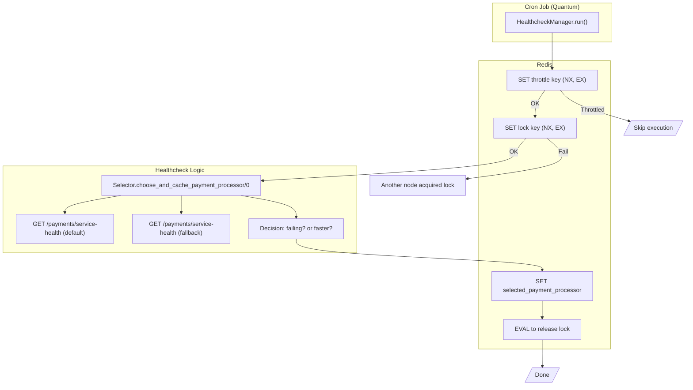

# Backend Fight – Elixir Project

This project was generated for the [Rinha de Backend 2025](https://github.com/zanfranceschi/rinha-de-backend-2025) competition using Phoenix Framework and Bandit as the HTTP server.

The goal is to provide a lightweight and efficient API-only Elixir application without database usage.

---

## 🔧 Generated with:

```bash
mix phx.new rinha-de-backend-2025-elixir \
  --app backend_fight \
  --module BackendFight \
  --database postgres \
  --adapter bandit \
  --no-assets \
  --no-dashboard \
  --no-gettext \
  --no-html \
  --no-live \
  --no-mailer
```

## ⚙️ How Payment Processor Selection Works

This system implements a **resilient and cache-friendly mechanism** to choose the most suitable payment processor (`default` or `fallback`) based on their health.

### 🧠 Decision Strategy

- Health is periodically checked for both processors using their `/payments/service-health` endpoints.
- A Redis-based throttle ensures that **only one selection attempt is made every N seconds**, regardless of how often the job is triggered.
- A distributed Redis lock prevents **multiple nodes** from running the check simultaneously.
- The selected processor is cached in Redis for **10 seconds** with a key like `selected_payment_processor`.
- Any service that needs the current processor simply reads it from Redis (`Selector.current_payment_processor/0`), falling back to `"default"` if the cache is missing or corrupted.

---

### 🧩 Main Modules

| Module | Responsibility |
|--------|----------------|
| `BackendFight.PaymentProcessors.Selector` | Selects the best processor based on health and caches the result |
| `BackendFight.Crons.PaymentProcessors.HealthcheckManager` | Schedules and throttles the healthcheck process using Redis throttle + lock |
| `BackendFight.Clients.PaymentProcessors.Default.Payments` | Calls the health endpoint of the default processor |
| `BackendFight.Clients.PaymentProcessors.Fallback.Payments` | Calls the health endpoint of the fallback processor |
| `BackendFight.Clients.HTTP` | Shared HTTP wrapper over Finch with optional timeout configuration |
| `BackendFight.DistributedLock` | Redis-based distributed lock using Lua + `SET NX EX` fallback |
| `BackendFight.Scheduler` | Cron scheduler powered by Quantum |
| `BackendFight.RedisMock` | Mox mock for Redis commands used in testing |

---

### 🗺️ Mermaid Diagram



### 📝 Notes

> This implementation might be considered overkill ("using a cannon") for a project like **Rinha de Backend**,  
> but it was a great excuse to experiment with **Quantum** for job scheduling and Redis for **distributed locking**, **throttling**, and **caching**.  
> I wanted to build something reusable and resilient — and just have fun playing with advanced patterns in Elixir!
>
> 🐳 **This setup is container-safe and works seamlessly across multiple nodes or containers**,  
> since Redis guarantees mutual exclusion (via distributed locks) and throttled access globally.
