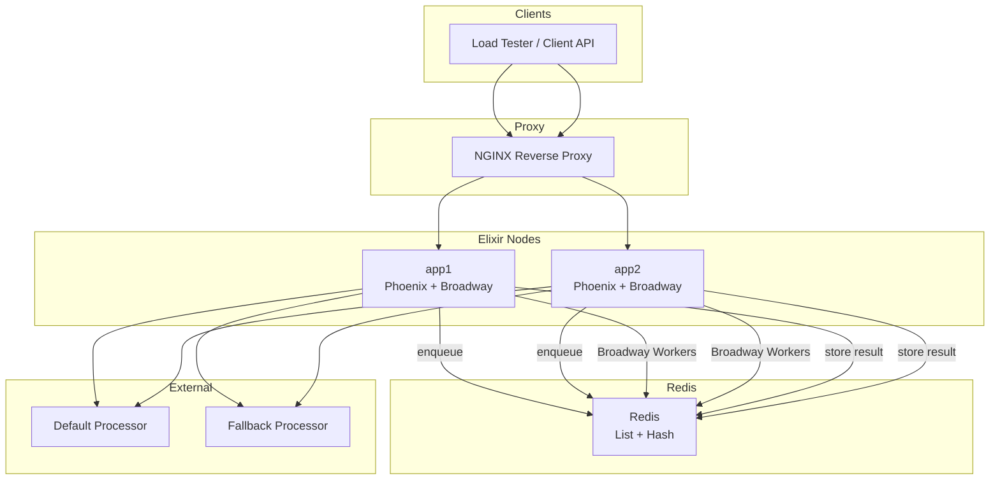
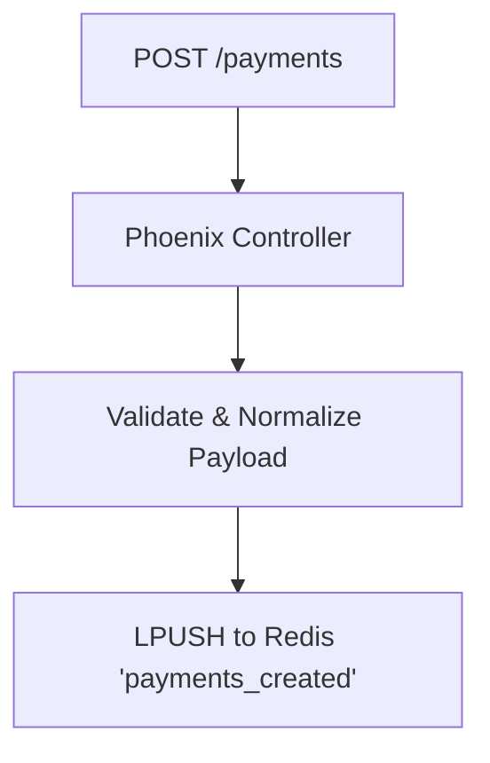
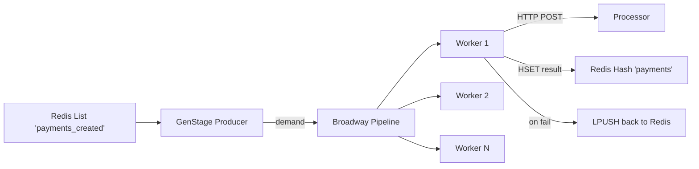

# Rinha de Backend 2025 — Elixir Async Payment Processor

## 🏆 Result

This solution achieved **100% consistency on the `amount` field** under heavy load.
It processed thousands of concurrent payment requests with:

* ✅ Zero inconsistencies
* ✅ Zero lost messages
* ✅ No OOM (Out-of-Memory) issues


---

## 🛠️ Overview

An ultra-efficient **asynchronous payment processor**, built in **Elixir** and optimized for low-memory environments (130MB per container).

> **Disclaimer:** There's still room for improvement, especially in:
>
> * Making the gateway selection logic more robust
> * Invalidation strategy when a processor becomes unresponsive
> * Error tracking and metrics collection

---

## 🔄 Core Flow



---

## 🚜 Payment Queue: How it Works

* All incoming payment requests are serialized as JSON and pushed into a Redis list called `payments_created`.
* This queue is consumed by a **Broadway pipeline**, which polls Redis through a custom `GenStage` producer.
* The system supports **backpressure**: demand is respected based on Broadway's flow control.
* Up to **100 workers** (configurable) consume messages concurrently, each attempting to process a payment.
* After a successful HTTP call to the selected processor (`default` or `fallback`), the result is persisted in a Redis hash called `payments`.
* If a payment fails (e.g., HTTP 500 or timeout), the JSON is **requeued** into the same Redis list, preserving delivery.

### Diagram: Payment Submission to Queue



### Diagram: Queue Processing with Broadway



This design ensures:

* ✅ **At-least-once delivery**
* ✅ **Natural retry logic**
* ✅ **Simple, scalable concurrency** using Redis and Elixir OTP

---

## 📅 API Endpoints

| Method | Endpoint            | Description                    |
| ------ | ------------------- | ------------------------------ |
| POST   | `/payments`         | Enqueues a payment to Redis    |
| GET    | `/payments-summary` | Summarizes payments by gateway |
| POST   | `/purge-payments`   | Flushes Redis storage          |
| GET    | `/healthcheck`      | Health check route             |

---

## ✨ Features

* Asynchronous queuing via Redis list (`payments_created`)
* Parallel processing with Broadway (100 workers)
* Smart processor selection: `default` vs `fallback`
* Result persistence in Redis hash (`payments`)
* Streaming-based summary to prevent OOM
* Redis locks & throttle for distributed healthchecks

---

## 🪜 Processor Healthcheck Logic

The system includes a **distributed and throttled healthcheck** runner that:

1. Runs every 5 seconds (throttled via Redis key)
2. Uses Redis `SET NX PX` for timing enforcement
3. Acquires distributed lock to prevent multiple nodes running healthcheck
4. Queries both processors (`default`, `fallback`) for health & latency
5. Chooses the optimal one and stores in Redis (`selected_payment_processor`)

### Selection Rules (simplified):

* If one is failing, choose the other
* If both are OK, pick the one with better latency (unless within 50ms, prefer `default`)
* If both fail, fallback to `default`

### Redis:

* Lock key: `healthcheck:lock`
* Throttle key: `healthcheck:throttle`
* Cache key: `selected_payment_processor`

> Note: Future improvements may include better invalidation or fallback heuristics.

---

## 🤖 Retry & Safety

* If a payment fails during processing (e.g. processor 500 error), it's automatically **requeued**.
* Messages are idempotent (based on `correlationId`) and persisted on success only.

---

## ✨ Memory-Safe Summary

The `/payments-summary` endpoint streams values from Redis to compute totals, using:

* `Stream.map`, `Stream.filter` (not `Enum`) to avoid full load in memory
* Filtering by `from`/`to` date if provided
* Aggregation by processor with `Float.round/2`

This was essential to avoid **Out-Of-Memory (OOM)** when containers were capped at 130MB.

---

## 🚀 Deployment Snapshot

```yaml
services:
  redis:
    image: redis:8.0.3-alpine
    deploy:
      resources:
        limits:
          cpus: "0.15"
          memory: "20MB"

  app1:
    build: .
    deploy:
      resources:
        limits:
          cpus: "0.6"
          memory: "150MB"

  app2:
    build: .
    deploy:
      resources:
        limits:
          cpus: "0.6"
          memory: "150MB"

  nginx:
    image: nginx:1.29.0-alpine
    deploy:
      resources:
        limits:
          cpus: "0.15"
          memory: "30MB"
```

### Total Resource Allocation

* **CPUs**: `0.15 + 0.6 + 0.6 + 0.15 = 1.5 CPUs`
* **Memory**: `20MB + 150MB + 150MB + 30MB = 350MB`

---

## 📂 Tech Stack

* **Language**: Elixir (OTP 28 / Elixir 1.18)
* **Queue**: Redis (no DB)
* **Concurrency**: Broadway + GenStage
* **HTTP Client**: Finch
* **Deployment**: Docker Compose
* **Container Limits**: 130MB app, 60MB Redis, 30MB NGINX
